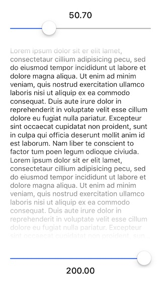

`IQGradientView` is a subclass to show Gradient Mask on the top and bottom..

## Screenshot

## Cocoapod:-

pod 'IQGradientView'

## LICENSE

Distributed under the MIT License.

## Contributions

Any contribution is more than welcome! You can contribute through pull requests and issues on GitHub.

## Author

If you wish to contact me, email at: hack.iftekhar@gmail.com
